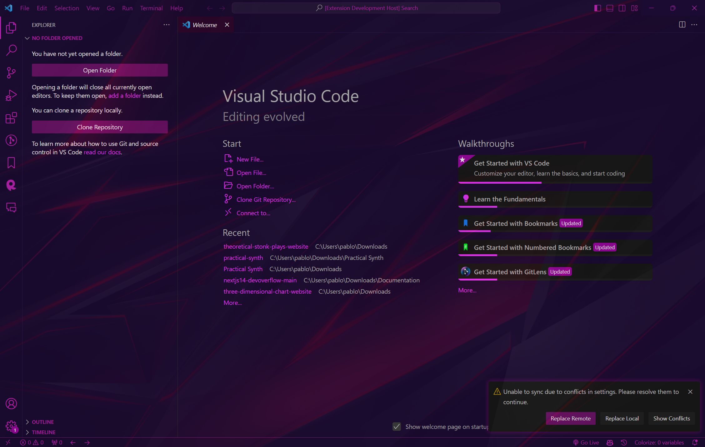
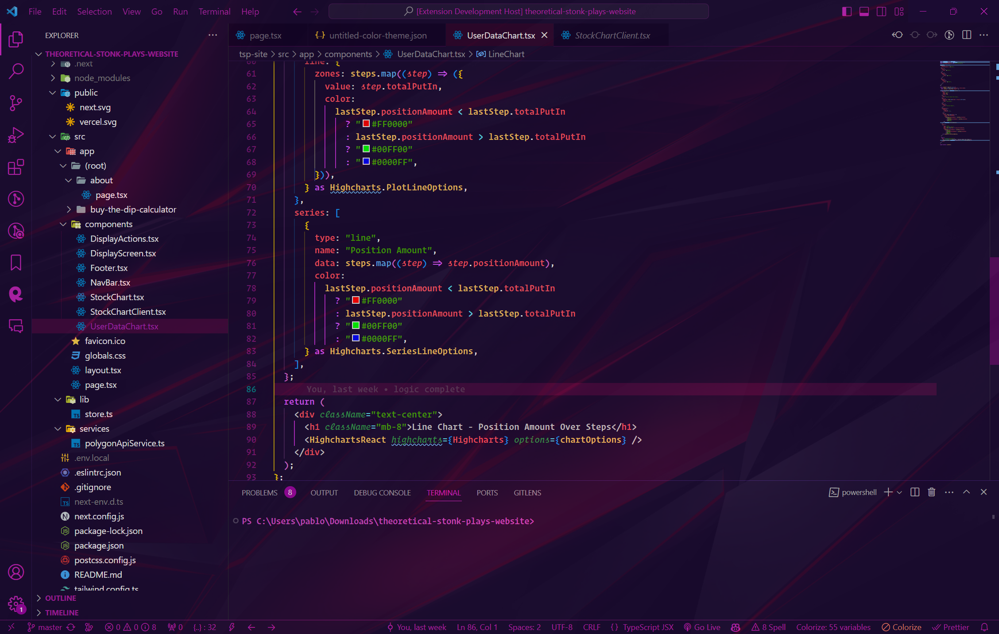
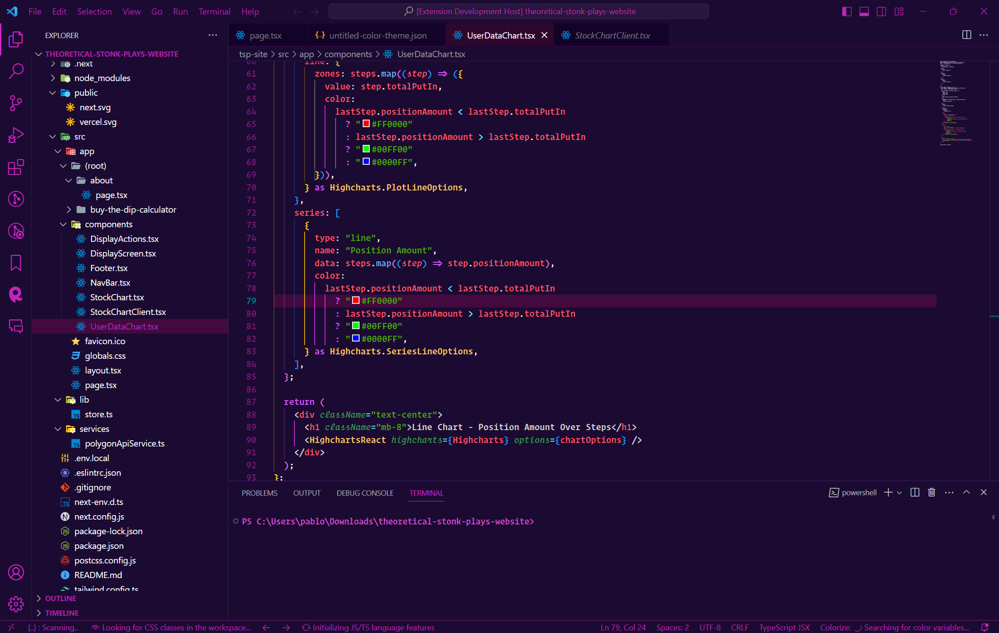

# Practical Synth Theme README

## Seriously read it, to make it as cool as the previews!




## Basic Description:

A practical synth wave color theme for coding, no blinding highlighter text, no distracting use or overuse of colors, my solution to a visually pleasing synth wave theme to code with (preferably in the dark)

## Highly Recommended:

To get the most out of this theme then I highly recommend you also get the extension

### "background"

and then open up your 'settings.json' for vscode, and if you don't know how to do that, then just go to the top
search bar on vscode and type

### '>Preferences Open User Settings (JSON)'

Now in the settings.json after you've installed 'background' you can type something like this at the bottom of the json
to add a really cool image that will go great with the theme and truly complete it, I've added some default urls as well, but you can easily change them as you see fit

```json

  "background.fullscreen": {
    "images": [ //also included some other image urls you might like, just uncomment them to use them, only 1 at a time though
      // "https://images.hdqwalls.com/wallpapers/red-abstract-gradient-d2.jpg",
      // "https://wallpapercrafter.com/desktop1/542362-abstract-3D-gradient-blue-orange-red-yellow.jpg"
      "https://images.hdqwalls.com/download/polygonal-abstract-red-dark-background-eo-1920x1080.jpg"
      // "https://img.wallpapic.com/i4258-129-113/medium/abstract-lights-red-orange-wallpaper.jpg"
      // "https://i.pinimg.com/736x/f6/22/d0/f622d0c93443bf471f62308d2710ed35.jpg"
    ], // urls of your images
    "opacity": 0.85, // 0.85 ~ 0.95 recommended, default is 0.9, don't go below 0.2, it will be very hard to see anything,
    //and if you go lower like 0.05 than that you will see the background image completely, and it will be extremely
    //difficult to see anything, 0.99 or something will barely show the image at all, it will be practically transparent,
    //0.9 is a good balance
    "size": "cover", // also css, `cover` to self-adaption (recommended)，or `contain`、`200px 200px`
    "position": "center", // alias to `background-position`, default `center`, options like `left-top`, `right-bottom`, 'top', etc.
    "interval": 0 // seconds of interval for carousel, default `0` to disabled.
  },

```

Now if you don't do this then you won't have the complete visual AWESOMENESS that I intended for this theme and you'll just
have the basic version, which looks nice, but it could definitely look cooler if you follow my instructions!



If you followed my recommendations then congrats, I hope you like the theme as much as I do!
And for those interested, here are some useful links,

- [Github Source Code](https://github.com/Valx01P/practical-synth)

- [Theme Creation Guide](https://www.youtube.com/watch?v=OikulYVz5ZM&ab_channel=ChristianLempa)

**Enjoy!**
